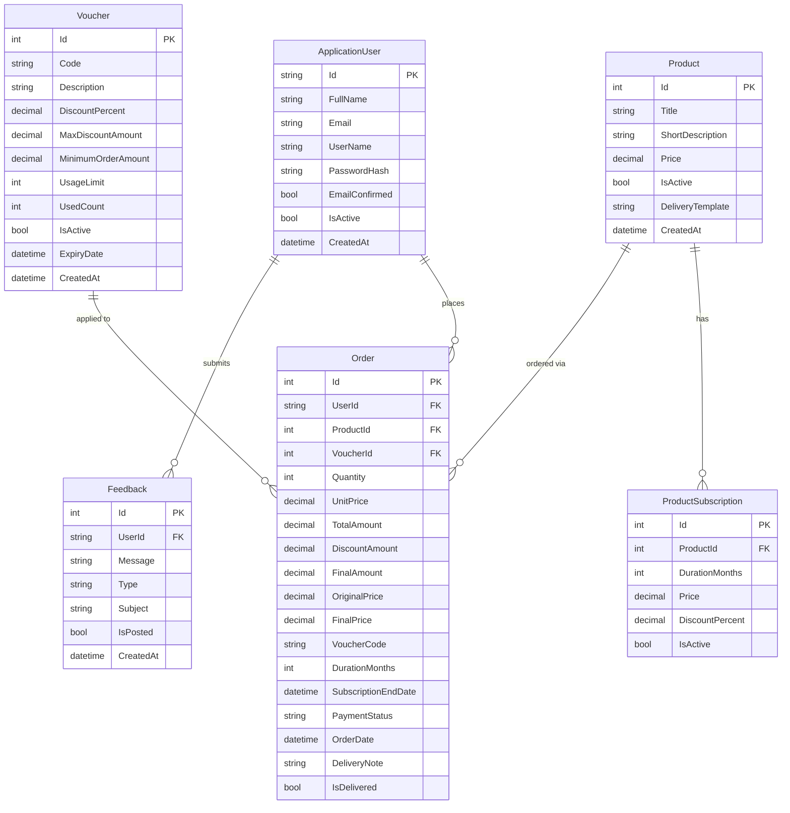

# Entity Relationship Diagram — LinearAI

## Relationships

| From | To | Type | Constraint |
|------|----|------|------------|
| `ApplicationUser` | `Order` | One-to-Many | RESTRICT delete — orders are never silently removed |
| `ApplicationUser` | `Feedback` | One-to-Many | CASCADE delete |
| `Product` | `ProductSubscription` | One-to-Many | CASCADE delete |
| `Product` | `Order` | One-to-Many | RESTRICT delete — soft-deactivate instead |
| `Voucher` | `Order` | One-to-Many | Optional FK — order may have no voucher |

## Notes

- `ProductSubscription.FinalPrice` is a calculated property (`Price - Price * DiscountPercent / 100`) — not stored in the database.
- `Voucher.IsValid` is a computed property — not stored in the database.
- `Order.PaymentStatus` stored as enum: `Pending`, `Paid`, `Failed`, `Cancelled`, `Refunded`.
- All `decimal` fields use precision `(18, 2)`.
- Deleting a `Product` that has orders performs a **soft delete** (`IsActive = false`) to preserve order history.
- `Order.DeliveryNote` and `Order.IsDelivered` support the delivery fulfilment workflow.
- `Product.DeliveryTemplate` is a reusable template that pre-fills the delivery note when an admin delivers an order.

## Identity Tables (ASP.NET Core Identity)

`ApplicationDbContext` inherits from `IdentityDbContext<ApplicationUser>`. Additional tables managed by Identity:

- `AspNetUsers` — maps to `ApplicationUser`
- `AspNetRoles`
- `AspNetUserRoles`
- `AspNetUserClaims`
- `AspNetUserLogins`
- `AspNetUserTokens`
- `AspNetRoleClaims`
