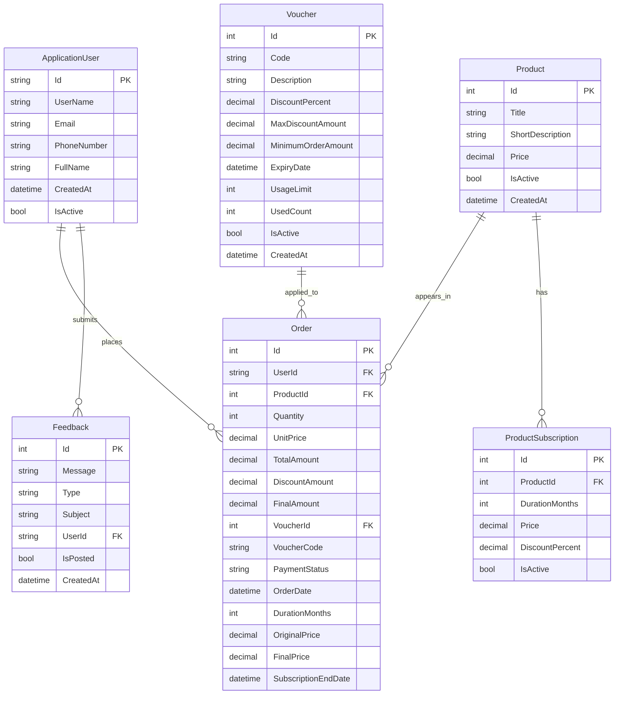

# Linear AI ERD

This ERD reflects the current Entity Framework Core model in the app.

## Mermaid ERD

## Relationship Notes

- One `ApplicationUser` can have many `Order` rows.
- One `ApplicationUser` can have many `Feedback` rows.
- One `Product` can have many `ProductSubscription` plans.
- One `Product` can appear in many `Order` rows.
- One `Voucher` can be referenced by many `Order` rows, but `VoucherId` is optional.
- `ProductSubscription.FinalPrice` is calculated in code and is not stored in the database.
- `Voucher.IsValid` is calculated in code and is not stored in the database.

## Identity Tables

Because `ApplicationDbContext` inherits from `IdentityDbContext<ApplicationUser>`, the database also includes standard ASP.NET Identity tables such as:

- `AspNetUsers`
- `AspNetRoles`
- `AspNetUserRoles`
- `AspNetUserClaims`
- `AspNetUserLogins`
- `AspNetUserTokens`
- `AspNetRoleClaims`

## Source

- [ApplicationDbContext.cs](/e:/vs%20code%20projects/linear_frontend/LinearAi_v1/Data/ApplicationDbContext.cs)
- [ApplicationUser.cs](/e:/vs%20code%20projects/linear_frontend/LinearAi_v1/Models/ApplicationUser.cs)
- [Product.cs](/e:/vs%20code%20projects/linear_frontend/LinearAi_v1/Models/Product.cs)
- [Order.cs](/e:/vs%20code%20projects/linear_frontend/LinearAi_v1/Models/Order.cs)
- [Voucher.cs](/e:/vs%20code%20projects/linear_frontend/LinearAi_v1/Models/Voucher.cs)
- [Feedback.cs](/e:/vs%20code%20projects/linear_frontend/LinearAi_v1/Models/Feedback.cs)
