# Use Case Diagram — LinearAI

```mermaid
graph LR
    %% Actors
    Guest(["👤 Guest"])
    User(["👤 User"])
    Admin(["👤 Admin"])
    Gateway(["🏦 Payment Gateway"])

    %% ── Guest use cases ──────────────────────────────
    subgraph UC_Guest["Guest"]
        G1["Browse Products"]
        G2["View Product Details"]
        G3["Register Account"]
        G4["Login"]
        G5["Confirm Email"]
        G6["View Public Reviews"]
    end

    %% ── User use cases ───────────────────────────────
    subgraph UC_User["Authenticated User"]
        U1["View Home / Featured Products"]
        U2["Browse Products"]
        U3["View Product Details"]
        U4["Add to Cart"]
        U5["Remove from Cart"]
        U6["Preview Voucher Discount"]
        U7["Checkout"]
        U8["View Order History"]
        U9["View Delivery Note"]
        U10["Submit Feedback / Contact"]
        U11["View Account Profile"]
        U12["Logout"]
    end

    %% ── Admin use cases ──────────────────────────────
    subgraph UC_Admin["Admin"]
        A1["View Dashboard Statistics"]
        A2["Create Product"]
        A3["Edit Product & Delivery Template"]
        A4["Deactivate / Delete Product"]
        A5["Manage Subscription Plans"]
        A6["View All Orders"]
        A7["Update Order Payment Status"]
        A8["Deliver Order & Send Email"]
        A9["Create Voucher"]
        A10["Toggle Voucher Active/Inactive"]
        A11["View All Feedback"]
        A12["Toggle Feedback Visibility"]
    end

    %% ── Payment Gateway use cases ────────────────────
    subgraph UC_GW["Payment Gateway"]
        GW1["Send Payment Callback"]
    end

    %% ── Connections ──────────────────────────────────
    Guest --> G1
    Guest --> G2
    Guest --> G3
    Guest --> G4
    Guest --> G5
    Guest --> G6

    User --> U1
    User --> U2
    User --> U3
    User --> U4
    User --> U5
    User --> U6
    User --> U7
    User --> U8
    User --> U9
    User --> U10
    User --> U11
    User --> U12

    Admin --> A1
    Admin --> A2
    Admin --> A3
    Admin --> A4
    Admin --> A5
    Admin --> A6
    Admin --> A7
    Admin --> A8
    Admin --> A9
    Admin --> A10
    Admin --> A11
    Admin --> A12

    Gateway --> GW1
```

## Actor Descriptions

| Actor | Description |
|-------|-------------|
| **Guest** | Unauthenticated visitor. Can browse products and public reviews. Must register and confirm email before logging in. |
| **User** | Authenticated customer with the `User` role. Can manage their cart, checkout, and view their order history and delivery notes. |
| **Admin** | Authenticated staff with the `Admin` role. Has full control over products, orders, vouchers, and feedback. |
| **Payment Gateway** | External server calling the webhook endpoint to mark orders as `Paid` or `Failed`. Authenticated via a shared secret header (`X-Payment-Secret`). |

## Use Case Details

### Guest
| Use Case | Endpoint |
|----------|----------|
| Browse Products | `GET /api/products` |
| View Product Details | `GET /api/products/{id}` |
| Register Account | `POST /api/auth/register` |
| Login | `POST /api/auth/login` |
| View Public Reviews | `GET /api/feedback/public` |

### User
| Use Case | Endpoint |
|----------|----------|
| View Home | `GET /api/user/home` |
| Browse Products | `GET /api/user/products` |
| Add to Cart | `POST /api/user/cart/items` |
| Remove from Cart | `DELETE /api/user/cart/items/{productId}` |
| Preview Voucher | `POST /api/user/cart/voucher` |
| Checkout | `POST /api/user/checkout` |
| View Order History | `GET /api/user/orders` |
| View Account Profile | `GET /api/user/account` |
| Submit Feedback | `POST /api/feedback` |
| Logout | `POST /api/auth/logout` |

### Admin
| Use Case | Endpoint |
|----------|----------|
| Dashboard | `GET /api/admin/dashboard` |
| List / Create / Edit / Delete Products | `GET/POST/PUT/DELETE /api/admin/products` |
| Manage Subscription Plans | `POST /api/admin/products/{id}/subscriptions` |
| List All Orders | `GET /api/orders` |
| Update Order Status | `PATCH /api/orders/{id}/status` |
| Deliver Order | `PATCH /api/orders/{id}/deliver` |
| List / Create Vouchers | `GET/POST /api/admin/vouchers` |
| Toggle Voucher | `PATCH /api/admin/vouchers/{id}/toggle` |
| View All Feedback | `GET /api/feedback/admin` |
| Toggle Feedback Visibility | `PATCH /api/feedback/{id}/post` |

### Payment Gateway
| Use Case | Endpoint |
|----------|----------|
| Payment Callback | `POST /api/orders/payment/callback` |
